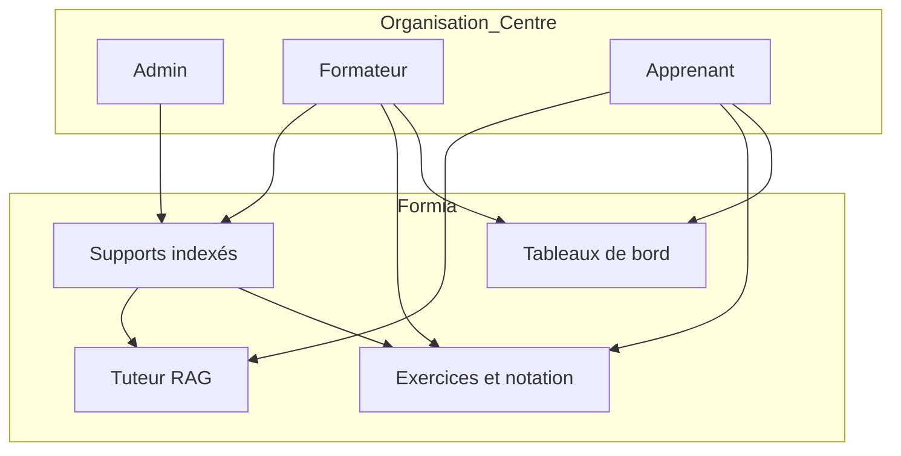
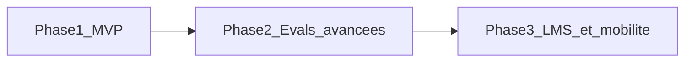
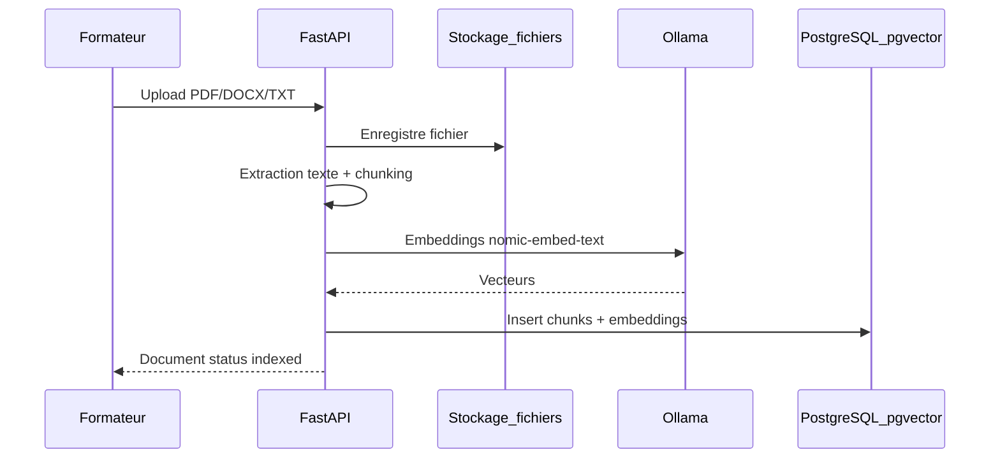
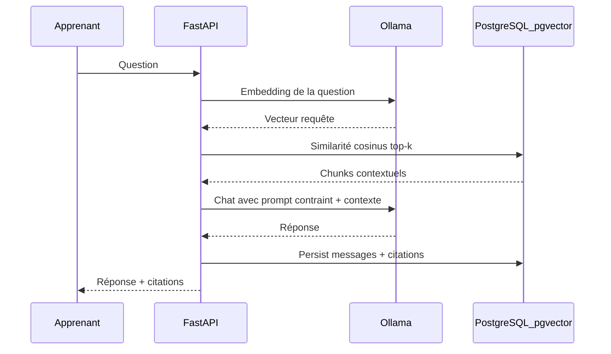
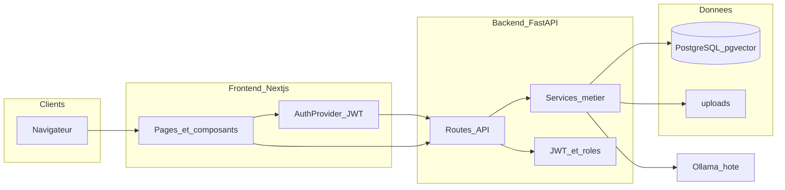
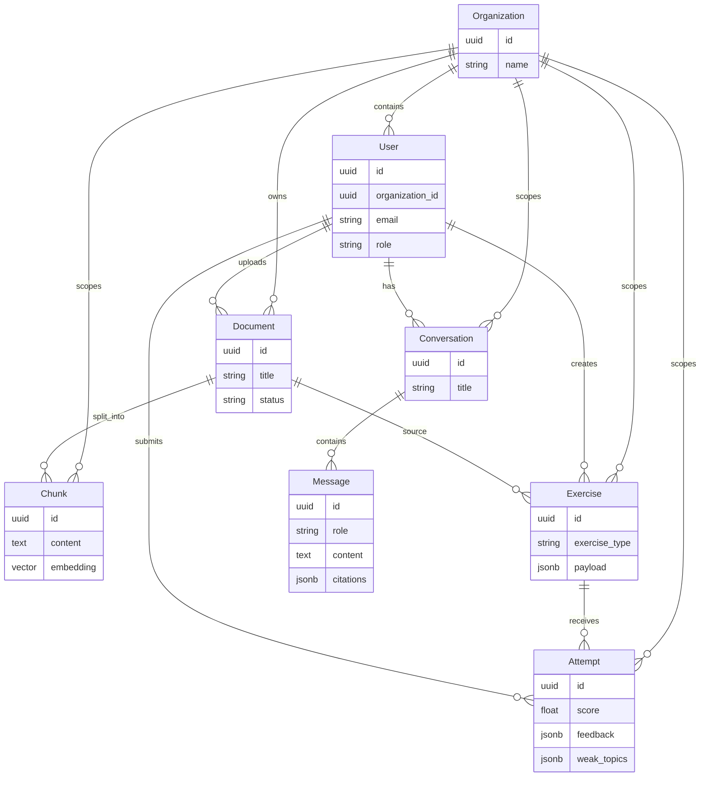
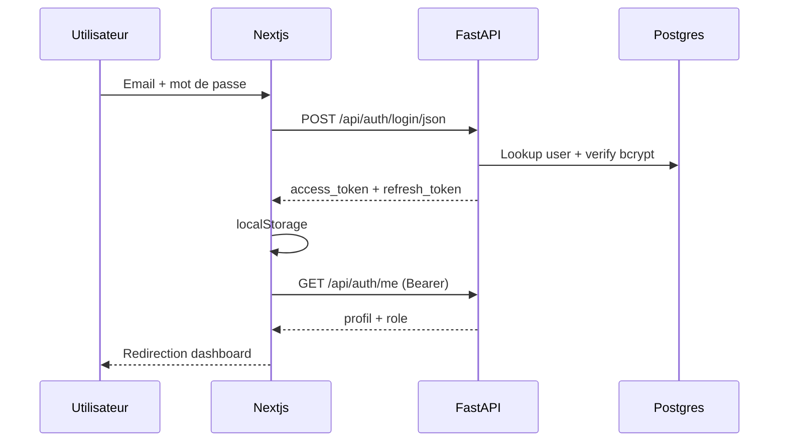
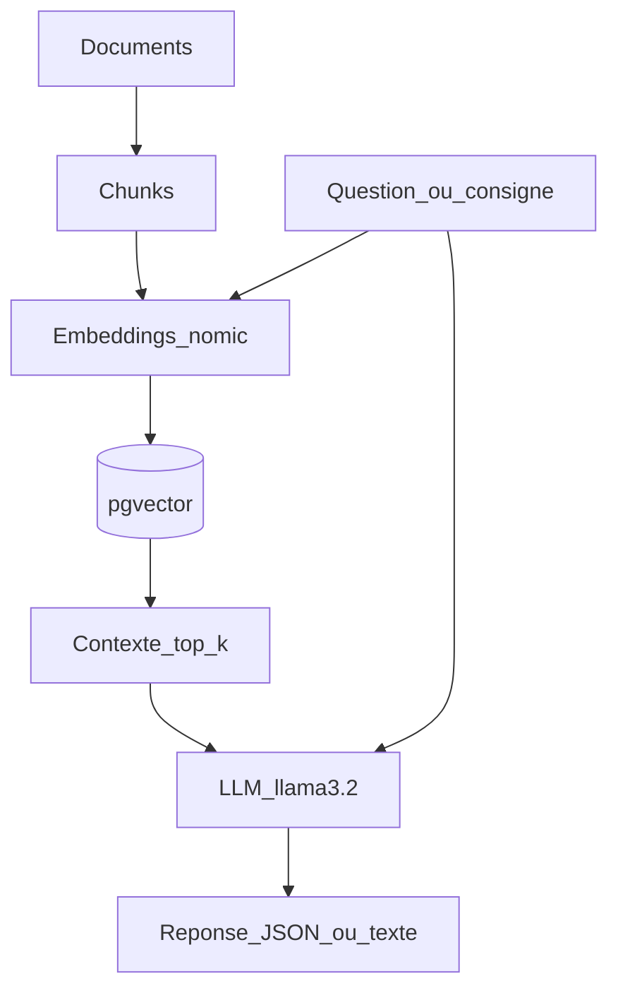
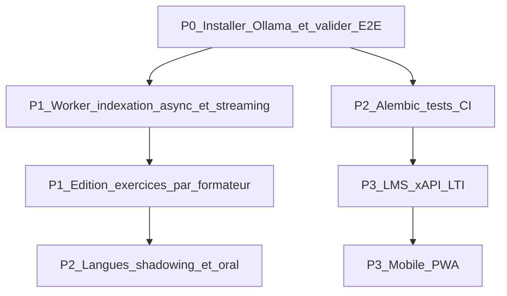
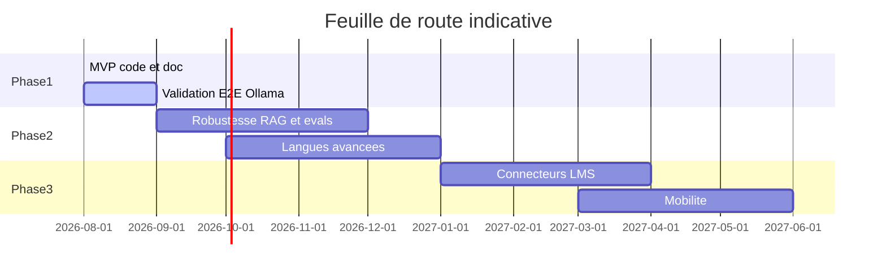

# Dossier technique — Agent IA de formation et d’évaluation pédagogique (Formia)

**Version document :** 1.0  
**Produit :** Formia (nom UI du MVP)  
**Statut :** MVP implémenté (Phase 1 élargie) — code livré, dépendances d’exécution à installer localement  
**Stack :** Next.js · FastAPI · PostgreSQL/pgvector · Ollama  
**Public du document :** porteur de projet, formateurs techniques, développeurs, décideurs formation  

---

## Table des matières

1. [Présentation du projet](#1-présentation-du-projet)
2. [Problème métier et promesse produit](#2-problème-métier-et-promesse-produit)
3. [Acteurs et parcours utilisateurs](#3-acteurs-et-parcours-utilisateurs)
4. [Ce qui doit être fait (vision complète du cahier des charges)](#4-ce-qui-doit-être-fait-vision-complète-du-cahier-des-charges)
5. [Comment le faire (méthode, principes, architecture cible)](#5-comment-le-faire-méthode-principes-architecture-cible)
6. [Architecture technique détaillée](#6-architecture-technique-détaillée)
7. [Modèle de données](#7-modèle-de-données)
8. [Flux fonctionnels (schémas pas à pas)](#8-flux-fonctionnels-schémas-pas-à-pas)
9. [Couches applicatives et responsabilités](#9-couches-applicatives-et-responsabilités)
10. [API REST du MVP](#10-api-rest-du-mvp)
11. [Interface utilisateur](#11-interface-utilisateur)
12. [Sécurité, multi-tenant et traçabilité](#12-sécurité-multi-tenant-et-traçabilité)
13. [Intelligence artificielle locale (RAG, exercices, langues)](#13-intelligence-artificielle-locale-rag-exercices-langues)
14. [Déploiement et environnement de développement](#14-déploiement-et-environnement-de-développement)
15. [État réel du MVP aujourd’hui — ce qui est fait](#15-état-réel-du-mvp-aujourdhui--ce-qui-est-fait)
16. [Ce qui reste à faire](#16-ce-qui-reste-à-faire)
17. [Limites, risques et conditions de fonctionnement](#17-limites-risques-et-conditions-de-fonctionnement)
18. [Roadmap Phase 2 et Phase 3](#18-roadmap-phase-2-et-phase-3)
19. [Glossaire](#19-glossaire)
20. [Annexes](#20-annexes)

---

## 1. Présentation du projet

### 1.1 Nature du produit

Formia est une **solution web d’accompagnement et d’évaluation pédagogique assistée par intelligence artificielle**, destinée aux centres de formation. L’idée centrale est simple mais structurante : **l’agent ne génère pas les cours**. Les supports pédagogiques (PDF, DOCX, TXT, et plus tard d’autres formats) sont fournis par les établissements. L’IA s’appuie exclusivement sur ces contenus pour :

- répondre aux questions des apprenants ;
- proposer des exercices d’entraînement ;
- corriger et noter ;
- détecter les difficultés ;
- produire des rapports de suivi pour les formateurs.

Le produit se positionne donc comme un **complément au formateur**, pas comme un remplacement. Le formateur reste maître du programme ; l’agent accélère l’entraînement individualisé, la pratique et le diagnostic.

### 1.2 Contexte

Les centres de formation disposent déjà de supports riches (supports de cours, référentiels, fiches métier, annales). Ce qui manque souvent, c’est :

- un dispositif disponible 24/7 pour **réviser avec un tuteur** ancré dans le vrai contenu du centre ;
- une génération d’exercices **cohérente avec le référentiel** (et non un contenu générique inventé) ;
- un **suivi transversal** des progressions et des points faibles, sans tableurs manuels.

Formia répond à ce besoin avec une architecture moderne, **gratuitement opérable en local** (Ollama + PostgreSQL + Docker), ce qui évite les coûts d’API cloud et facilite la souveraineté des données pédagogiques.

### 1.3 Nom et périmètre documentaire

- **Nom produit UI :** Formia  
- **Nom projet / dépôt :** Agent IA de formation et d’évaluation pédagogique  
- **Chemin Windows (accents) :** dossier Documents d’origine  
- **Jonction ASCII recommandée pour le terminal :** `C:\Users\josue\Documents\agent-formation`  

Ce dossier technique décrit à la fois **la vision complète** (cahier des charges) et **l’état concret du code MVP** livré.

---

## 2. Problème métier et promesse produit

### 2.1 Problème

Dans un centre de formation, l’apprenant a besoin de s’entraîner entre les sessions. S’il utilise un chatbot généraliste (ChatGPT, etc.), les réponses peuvent :

- inventer des notions absentes du programme ;
- contredire le support officiel ;
- ne pas respecter le vocabulaire métier du centre ;
- ne pas produire de traces exploitables pour le formateur.

Le formateur, de son côté, n’a pas le temps de produire manuellement des dizaines de QCM, d’études de cas et de corrections personnalisées pour chaque apprenant.

### 2.2 Promesse

> « À partir des supports que vous déposez, Formia accompagne, entraîne et évalue vos apprenants, puis vous montre où ils bloquent. »

Cette promesse implique des contraintes techniques fortes :

1. **Ancrage documentaire (RAG)** : retrieval + génération contrainte.  
2. **Isolation organisationnelle** : un centre ne voit pas les contenus d’un autre.  
3. **Traçabilité** : chaque tentative d’exercice est historisée.  
4. **Rôles** : admin, formateur, apprenant n’ont pas les mêmes droits.

---

## 3. Acteurs et parcours utilisateurs

### 3.1 Acteurs du cahier des charges

| Acteur | Besoin principal |
|--------|------------------|
| Centre de formation | Isoler ses contenus, piloter l’offre pédagogique numérique |
| Formateur | Importer supports, générer exercices, suivre le groupe |
| Apprenant | Poser des questions, s’entraîner, voir sa progression |
| Entreprise (cible Phase ultérieure) | Consulter des rapports de montée en compétences |

### 3.2 Rôles techniques dans le MVP

| Rôle code | Droits principaux |
|-----------|-------------------|
| `admin` | Tout le périmètre formateur + vision organisation |
| `trainer` | Upload documents, génération d’exercices, dashboard formateur, export CSV |
| `learner` | Chat, passer exercices, langues, dashboard personnel |

### 3.3 Schéma des acteurs



### 3.4 Parcours type « journée formateur »

1. Se connecter avec le compte formateur.  
2. Aller dans **Supports**.  
3. Importer un PDF/DOCX/TXT (ex. `sample_cours.txt`).  
4. Attendre le statut `indexed` (nécessite Ollama pour les embeddings).  
5. Aller dans **Exercices**, choisir le document, générer un QCM ou une simulation d’examen.  
6. Consulter le **Tableau de bord** pour voir les difficultés récurrentes du groupe.  
7. Exporter un **CSV** de reporting.

### 3.5 Parcours type « journée apprenant »

1. Se connecter.  
2. Ouvrir le **Tuteur IA**, poser une question sur le cours.  
3. Lire la réponse **avec citations** des extraits sources.  
4. Passer un exercice, soumettre, lire le feedback.  
5. Consulter ses points faibles sur le dashboard.  
6. Optionnel : module **Langues** (grammaire / compréhension / prononciation).

---

## 4. Ce qui doit être fait (vision complète du cahier des charges)

Cette section décrit **l’intégralité de ce que le produit doit couvrir à terme**, pas seulement le MVP.

### 4.1 Périmètre fonctionnel global

#### A. Gestion des contenus

- Import de supports pédagogiques fournis par le centre.  
- Indexation sémantique (chunks + embeddings).  
- Mise à jour / suppression.  
- Isolation par organisation (et plus tard par formation / promo / module).  
- Traçabilité de qui a uploadé quoi.

#### B. Accompagnement (tuteur)

- Questions interactives en langage naturel.  
- Réponses basées uniquement sur le contexte indexé.  
- Citations / renvois vers les sources.  
- Historique de conversations.  
- Filtrage optionnel sur un document précis.

#### C. Entraînement et évaluation (toutes matières)

- QCM  
- Questions ouvertes (notation assistée)  
- Études de cas  
- Exercices pratiques (à enrichir)  
- Simulations d’examen (série + contrainte temps)

#### D. Module langues

- Shadowing  
- Prononciation  
- Fluidité  
- Correction orthographique et grammaticale  
- Compréhension orale et écrite  

#### E. Suivi et reporting

- Historique des tentatives  
- Progression  
- Détection des difficultés  
- Rapports formateur / centre  
- Statistiques agrégées  
- Exports  

#### F. Exigences transverses

- Application web responsive  
- Gestion des utilisateurs et rôles  
- Sécurité des données  
- API LMS (Phase 3)  
- Traçabilité pédagogique  

### 4.2 Ce que le produit ne doit PAS faire

- Générer un cours complet à la place du formateur.  
- Inventer des faits absents des supports.  
- Mélanger les contenus de deux centres.  
- Remplacer l’évaluation certificative humaine sans cadre (le MVP produit des scores d’entraînement ; la certification officielle reste hors scope métier sauf cadrage ultérieur).

### 4.3 Découpage en phases (stratégie de livraison)



| Phase | Objectif | Contenu clé |
|-------|---------|-------------|
| Phase 1 (MVP) | Démontrer la valeur | Import, RAG, exercices, dashboards, langues basiques, stack locale |
| Phase 2 | Qualité pédagogique | Calibrage évaluations, banque d’items, shadowing, voix robuste |
| Phase 3 | Intégration écosystème | API LMS (xAPI/SCORM), SSO, app mobile, multi-centres avancé |

---

## 5. Comment le faire (méthode, principes, architecture cible)

### 5.1 Principes de conception

1. **Content-grounded first** : toute génération (réponse, question, feedback) doit pouvoir s’expliquer par un passage indexé.  
2. **Multi-tenant dès le jour 1** : chaque table métier porte `organization_id`.  
3. **Local-first / coût zéro API** : Ollama pour LLM et embeddings ; pas de dépendance obligatoire à OpenAI.  
4. **Séparation des rôles** : le front n’est qu’un client ; les règles d’autorisation sont côté API.  
5. **Traçabilité** : conversations, messages, attempts stockés.  
6. **Itération par sprints** : fondations → RAG → exercices → reporting → langues.

### 5.2 Pourquoi cette stack

| Couche | Choix | Justification |
|--------|-------|---------------|
| Front | Next.js (App Router) + TypeScript + Tailwind | Rapidité UI, typage, écosystème React mature |
| Back | FastAPI | API async-friendly, docs OpenAPI auto, Python idéal pour NLP |
| DB | PostgreSQL + pgvector | Une seule base pour relationnel + recherche vectorielle |
| IA | Ollama | Gratuit, local, modèles open |
| Auth | JWT | Simple pour MVP, portable |
| Fichiers | Disque local `uploads/` | Zéro coût ; S3 possible plus tard |

### 5.3 Méthode RAG retenue



Puis, au moment d’une question apprenant :



### 5.4 Organisation du travail (sprints réalisés dans le plan)

| Sprint | Intention |
|--------|-----------|
| Sprint 0 | Monorepo, auth, modèles, shell UI |
| Sprint 1 | Import + RAG + chat cité |
| Sprint 2 | Exercices multiples + notation |
| Sprint 3 | Dashboards + export |
| Sprint 4 | Module langues basique |

---

## 6. Architecture technique détaillée

### 6.1 Vue d’ensemble



### 6.2 Structure du dépôt (état actuel)

```text
/
├── docker-compose.yml          # Postgres (+ service API optionnel)
├── README.md                   # Démarrage rapide
├── DOSSIER_TECHNIQUE.md        # Ce document
├── sample_cours.txt            # Contenu démo à importer
├── backend/
│   ├── app/
│   │   ├── main.py             # Bootstrap FastAPI + seed
│   │   ├── core/               # config, security, deps
│   │   ├── models/             # SQLAlchemy
│   │   ├── schemas/            # Pydantic I/O
│   │   ├── api/routes/         # auth, documents, chat, exercises, dashboard, languages, health
│   │   ├── services/           # ollama, ingest, rag, grading, languages, seed
│   │   └── db/                 # engine, session, init_db
│   ├── uploads/                # Fichiers uploadés
│   ├── requirements.txt
│   ├── Dockerfile
│   └── .env / .env.example
└── frontend/
    └── src/
        ├── app/                # login, dashboard, documents, chat, exercises, languages
        ├── components/         # AppShell
        └── lib/                # api.ts, auth.tsx
```

### 6.3 Communication front ↔ back

- Base URL API : `http://localhost:8000` (`NEXT_PUBLIC_API_URL`)  
- Auth : header `Authorization: Bearer <access_token>`  
- Tokens stockés dans `localStorage` (MVP ; à durcir en Phase 2 avec cookies httpOnly si besoin)  
- CORS autorisé pour `http://localhost:3000`

### 6.4 Conteneurisation

`docker-compose.yml` orchestre :

- **postgres** : image `pgvector/pgvector:pg16`, DB `agent_formation`, user/password `agent`  
- **Port hôte actuel :** `5433→5432` (contournement d’un PostgreSQL Windows déjà présent sur 5432)  
- **api** (optionnel via compose) : build `backend/`, joint Ollama via `host.docker.internal`

En pratique de développement, l’API est souvent lancée **hors Docker** avec uvicorn, ce qui simplifie le hot-reload.

---

## 7. Modèle de données

### 7.1 Schéma conceptuel



### 7.2 Tables et rôles métier

#### `organizations`
Représente un centre (ou une entité cliente). Toutes les données métier sont rattachées à une organisation. Dans le seed MVP : **« Centre Demo »**.

#### `users`
Compte applicatif. Champs clés : email unique, mot de passe hashé (bcrypt), rôle (`admin` / `trainer` / `learner`), `organization_id`, `is_active`.

#### `documents`
Métadonnées d’un support uploadé. Statuts :
- `pending` : en cours / non finalisé  
- `indexed` : chunks + embeddings OK  
- `failed` : erreur (souvent Ollama indisponible, format illisible, texte vide)

#### `chunks`
Unités de retrieval. Contiennent le texte découpé, l’index d’ordre, l’embedding (dimension **768** pour `nomic-embed-text`), et des métadonnées JSON.

#### `conversations` / `messages`
Historique du tuteur. Les messages assistant peuvent stocker des `citations` (document, extrait, index de chunk).

#### `exercises`
Exercice généré ou (plus tard) édité. `payload` JSON flexible selon le type (`qcm`, `open`, `case`, `exam`).

#### `attempts`
Tentative d’un apprenant : réponses, score, score max, feedback détaillé, topics faibles, durée.

### 7.3 Paramètres de chunking (config)

Dans `backend/app/core/config.py` :

- `CHUNK_SIZE` = 800 caractères (ordre de grandeur)  
- `CHUNK_OVERLAP` = 120  
- `EMBEDDING_DIM` = 768  
- `OLLAMA_LLM_MODEL` = `llama3.2` (configurable)  
- `OLLAMA_EMBED_MODEL` = `nomic-embed-text`

Ces paramètres sont **centralisés** volontairement : la qualité RAG dépend fortement du découpage.

---

## 8. Flux fonctionnels (schémas pas à pas)

### 8.1 Authentification



Comptes seed :

| Email | Mot de passe | Rôle |
|-------|--------------|------|
| admin@demo.local | admin123 | admin |
| formateur@demo.local | trainer123 | trainer |
| apprenant@demo.local | learner123 | learner |

### 8.2 Import et indexation

1. Formateur choisit titre + fichier.  
2. API vérifie l’extension (`.pdf`, `.docx`, `.txt`).  
3. Fichier écrit dans `uploads/`.  
4. Extraction :
   - TXT : lecture UTF-8  
   - PDF : `pypdf`  
   - DOCX : `python-docx`  
5. Chunking.  
6. Appels Ollama `/api/embeddings` pour chaque chunk.  
7. Insertion pgvector.  
8. Statut `indexed` ou `failed` + message d’erreur.

### 8.3 Chat tuteur

1. L’apprenant envoie un message (conversation nouvelle ou existante).  
2. Embedding de la question.  
3. Recherche des chunks les plus proches (`<=>` distance cosinus pgvector), filtrés par `organization_id` (+ `document_id` optionnel).  
4. Construction d’un prompt système : « répondre uniquement à partir du contexte ».  
5. Appel Ollama `/api/chat`.  
6. Persistance user + assistant + citations.  
7. Affichage UI avec extraits sources.

### 8.4 Génération d’exercice

1. Formateur choisit document indexé + type + nombre de questions.  
2. Retrieval de contexte dans le document.  
3. Prompt JSON structuré selon le type.  
4. Parsing JSON de la réponse Ollama.  
5. Stockage `exercises.payload`.  
6. Les apprenants de la même organisation voient l’exercice et peuvent le passer.

### 8.5 Notation

- **QCM** : comparaison d’index de réponse (déterministe).  
- **Ouvertes / cas** : appel LLM de correction avec points attendus → score + feedback + flag `weak`.  
- Agrégation score / max_score + liste `weak_topics`.

### 8.6 Reporting

- **Apprenant** : nb tentatives, moyenne, topics faibles, tentatives récentes.  
- **Formateur** : effectifs, docs indexés, moyenne groupe, difficultés récurrentes, scores par type, export CSV.

---

## 9. Couches applicatives et responsabilités

### 9.1 Backend — services

| Service | Fichier | Rôle |
|---------|---------|------|
| Ollama client | `services/ollama.py` | embeddings, chat, parse JSON |
| Ingest | `services/ingest.py` | extraction + chunking |
| RAG | `services/rag.py` | retrieval + réponse citée |
| Grading | `services/grading.py` | génération payload + notation |
| Languages | `services/languages.py` | grammaire, compréhension, Whisper stub |
| Seed | `services/seed.py` | org + 3 users démo |

### 9.2 Backend — sécurité

| Élément | Fichier | Rôle |
|---------|---------|------|
| Settings | `core/config.py` | variables d’environnement |
| Crypto JWT / bcrypt | `core/security.py` | hash, tokens |
| Dépendances FastAPI | `core/deps.py` | `get_current_user`, `require_roles` |

### 9.3 Frontend — modules

| Module | Rôle |
|--------|------|
| `lib/api.ts` | Client HTTP typé de toutes les routes |
| `lib/auth.tsx` | Contexte auth, login/logout/refresh profil |
| `components/AppShell.tsx` | Navigation par rôle, layout |
| Pages `app/*` | Écrans métier |

---

## 10. API REST du MVP

Préfixe global : `/api`  
Documentation interactive : `http://localhost:8000/docs`

### 10.1 Santé

| Méthode | Chemin | Auth | Description |
|---------|--------|------|-------------|
| GET | `/api/health` | non | Liveness |

### 10.2 Auth

| Méthode | Chemin | Auth | Description |
|---------|--------|------|-------------|
| POST | `/api/auth/login` | non | OAuth2 form (Swagger) |
| POST | `/api/auth/login/json` | non | Login JSON front |
| POST | `/api/auth/refresh` | non | Nouveau couple de tokens |
| GET | `/api/auth/me` | oui | Profil courant |

### 10.3 Documents

| Méthode | Chemin | Auth | Rôles | Description |
|---------|--------|------|-------|-------------|
| GET | `/api/documents` | oui | tous | Liste org |
| POST | `/api/documents/upload` | oui | admin, trainer | Upload + index |
| DELETE | `/api/documents/{id}` | oui | admin, trainer | Suppression |

### 10.4 Chat

| Méthode | Chemin | Auth | Description |
|---------|--------|------|-------------|
| GET | `/api/chat/conversations` | oui | Liste conversations user |
| GET | `/api/chat/conversations/{id}/messages` | oui | Historique |
| POST | `/api/chat` | oui | Message + réponse RAG |

### 10.5 Exercices

| Méthode | Chemin | Auth | Rôles | Description |
|---------|--------|------|-------|-------------|
| GET | `/api/exercises` | oui | tous | Liste |
| GET | `/api/exercises/attempts/me` | oui | tous | Tentatives user |
| GET | `/api/exercises/{id}` | oui | tous | Détail |
| POST | `/api/exercises/generate` | oui | admin, trainer | Génération IA |
| POST | `/api/exercises/{id}/attempts` | oui | tous | Soumission + note |

### 10.6 Dashboard

| Méthode | Chemin | Auth | Rôles | Description |
|---------|--------|------|-------|-------------|
| GET | `/api/dashboard/learner` | oui | tous | Stats perso |
| GET | `/api/dashboard/trainer` | oui | admin, trainer | Stats groupe |
| GET | `/api/dashboard/trainer/export.csv` | oui | admin, trainer | Export |

### 10.7 Langues

| Méthode | Chemin | Auth | Description |
|---------|--------|------|-------------|
| POST | `/api/languages/grammar` | oui | Correction écrite |
| POST | `/api/languages/comprehension` | oui | Exercice compréhension depuis doc |
| POST | `/api/languages/pronunciation` | oui | Analyse (Whisper si installé) |

---

## 11. Interface utilisateur

### 11.1 Écrans livrés

| Route | Écran | Contenu |
|-------|-------|---------|
| `/login` | Connexion | Branding Formia + formulaire |
| `/dashboard` | Tableau de bord | Stats apprenant + bloc formateur si rôle |
| `/documents` | Supports | Upload, liste, suppression (formateur) |
| `/chat` | Tuteur IA | Conversations, filtre document, citations |
| `/exercises` | Exercices | Génération (formateur), passage, feedback |
| `/languages` | Langues | Grammaire, compréhension, prononciation |

### 11.2 UX / design

- Identité visuelle verte / naturelle (pas le cliché violet IA).  
- Typo display : Fraunces ; texte : Source Sans 3.  
- Shell latéral avec navigation filtrée par rôle.  
- États de chargement (« Indexation… », « Génération… », « Correction… ») pour compenser la latence locale sans GPU.

### 11.3 Responsive

Layout adaptatif (`flex-col` mobile / `flex-row` desktop). Les écrans restent utilisables sur tablette ; une app native n’est pas dans le MVP.

---

## 12. Sécurité, multi-tenant et traçabilité

### 12.1 Authentification

- Mots de passe hashés avec **bcrypt** (passlib).  
- JWT signé HS256 (`SECRET_KEY`).  
- Access token courte durée + refresh token plus long.

### 12.2 Autorisation

- Dépendance `require_roles(...)` sur les routes sensibles.  
- Le front masque certains menus, mais **l’API refuse** aussi (défense en profondeur).

### 12.3 Isolation multi-tenant

Toutes les requêtes métier filtrent sur `user.organization_id`. Un apprenant du Centre A ne peut pas lire les chunks / exercices du Centre B.

### 12.4 Traçabilité pédagogique

- Messages de chat persistés.  
- Attempts avec score, feedback JSON, weak topics, durée.  
- Export CSV formateur pour archivage / reporting externe.

### 12.5 Limites de sécurité du MVP (à connaître)

- Tokens en `localStorage` (XSS = risque).  
- Pas encore de rate limiting.  
- Pas encore de chiffrement fichier au repos au-delà du disque OS.  
- Pas de SSO / MFA.  
- `SECRET_KEY` de démo à changer en production.  

Ces points appartiennent clairement au « reste à faire » hardening.

---

## 13. Intelligence artificielle locale (RAG, exercices, langues)

### 13.1 Composants IA



### 13.2 Prompts (philosophie)

Les prompts système imposent :

- répondre / générer **uniquement** à partir du contexte ;  
- avouer l’absence d’information plutôt qu’inventer ;  
- produire du JSON quand on génère des exercices ou une correction structurée.

### 13.3 Module langues — détail

| Fonction | Implémentation MVP | Maturité |
|----------|--------------------|----------|
| Grammaire / orthographe | LLM local JSON `corrected_text` + `explanations` | Fonctionnelle si Ollama up |
| Compréhension écrite | Génération QCM depuis chunks du document | Fonctionnelle si Ollama + doc indexé |
| Prononciation | Upload audio optionnel + `faster-whisper` si installé ; sinon stub comparant texte | Partielle |
| Shadowing fluide | Non implémenté (Phase 2) | À faire |
| Compréhension orale riche | Non implémenté | À faire |

### 13.4 Qualité attendue selon le matériel

| Matériel | Expérience probable |
|----------|---------------------|
| 16 Go+ RAM + GPU | Confortable |
| 16 Go RAM CPU only | Utilisable, lent |
| 8 Go RAM | Possible avec `llama3.2:1b`, qualité limitée |
| Sans Ollama | Auth/UI/DB OK ; IA échoue (documents `failed`, chat 503) |

---

## 14. Déploiement et environnement de développement

### 14.1 Prérequis

- Docker Desktop  
- Node.js 20+  
- Python 3.12+  
- Ollama installé et modèles tirés  

### 14.2 Commandes de référence

```bash
# 1) Base
docker compose up -d postgres

# 2) Modèles IA
ollama pull llama3.2
ollama pull nomic-embed-text

# 3) API
cd backend
python -m venv .venv
.\.venv\Scripts\activate
pip install -r requirements.txt
uvicorn app.main:app --reload --port 8000

# 4) Front
cd frontend
npm install
npm run dev
```

### 14.3 URLs

- Front : http://localhost:3000  
- API : http://localhost:8000  
- OpenAPI : http://localhost:8000/docs  

### 14.4 Variables d’environnement importantes

Voir `backend/.env.example` :

- `DATABASE_URL` (port **5433** en local actuel)  
- `SECRET_KEY`  
- `OLLAMA_BASE_URL` (`http://localhost:11434`)  
- `OLLAMA_LLM_MODEL` / `OLLAMA_EMBED_MODEL`  
- `CORS_ORIGINS`  

### 14.5 Fichier de démonstration

`sample_cours.txt` : texte pédagogique sur la sécurité au travail, prévu pour un premier import formateur.

---

## 15. État réel du MVP aujourd’hui — ce qui est fait

Cette section est **factuelle** : elle décrit ce qui existe dans le code et ce qui a été vérifié.

### 15.1 Synthèse exécutive

Le MVP prévu par le plan (sprints 0 à 4) est **implémenté dans le dépôt** :

- monorepo front/back ;  
- auth JWT + seed ;  
- import + pipeline RAG ;  
- chat cité ;  
- exercices multi-types + notation ;  
- dashboards + CSV ;  
- module langues basique ;  
- UI responsive Formia ;  
- README de démarrage.

### 15.2 Vérifications déjà effectuées en environnement de dev

| Contrôle | Résultat |
|----------|----------|
| PostgreSQL Docker (pgvector) | Healthy (port hôte 5433) |
| Boot API + `/api/health` | OK |
| Login `apprenant@demo.local` | OK (token JWT) |
| Compilation TypeScript front | OK (`tsc --noEmit`) |
| Présence Ollama sur la machine au moment des tests | **Non installé** (à faire par l’utilisateur) |

### 15.3 Important — « fonctionnel » veut dire quoi ?

Il faut distinguer deux niveaux :

1. **Fonctionnel au sens logiciel** : les écrans, routes, modèles, règles de rôle, pipelines sont codés et branchés.  
2. **Fonctionnel au sens bout-en-bout IA** : nécessite qu’**Ollama tourne** avec les modèles tirés. Sans Ollama, l’application s’ouvre, on se connecte, on navigue, mais l’indexation / le chat / la génération d’exercices / la grammaire échoueront (statut `failed` ou erreur 503).

Donc : **oui, le MVP est livré et opérable**, à condition d’installer la dépendance IA locale prévue dès le cadrage (choix stack gratuite 2C). Ce n’est pas un bug d’architecture : c’est une **précondition d’exécution**.

### 15.4 Détail sprint par sprint — fait

#### Sprint 0 — Fondations : FAIT

- Structure `frontend/` + `backend/` + `docker-compose.yml` + `.env.example` + README  
- Modèles Organization, User, Document, Chunk, Conversation, Message, Exercise, Attempt  
- Auth login / refresh / me  
- Seed 3 rôles  
- Shell UI + pages de base  

#### Sprint 1 — Import + RAG : FAIT (code)

- Upload PDF/DOCX/TXT  
- Extraction + chunking + embeddings  
- Chat + conversations + citations  
- Filtre org (+ document optionnel)  

#### Sprint 2 — Exercices : FAIT (code)

- Types `qcm`, `open`, `case`, `exam`  
- Génération depuis document indexé  
- Soumission + notation (déterministe QCM / LLM ouvertes)  
- Historique attempts  

#### Sprint 3 — Dashboard : FAIT

- Stats apprenant  
- Stats formateur  
- Difficultés récurrentes  
- Scores par type  
- Export CSV  

#### Sprint 4 — Langues : FAIT (niveau basique prévu)

- Grammaire  
- Compréhension écrite liée aux docs  
- Prononciation avec branche Whisper optionnelle + fallback  

### 15.5 Inventaire des fichiers UI livrés

- `login/page.tsx`  
- `dashboard/page.tsx`  
- `documents/page.tsx`  
- `chat/page.tsx`  
- `exercises/page.tsx`  
- `languages/page.tsx`  
- `AppShell.tsx`, `auth.tsx`, `api.ts`  

### 15.6 Inventaire des routes API livrées

Health, auth (4), documents (3), chat (3), exercises (5), dashboard (3), languages (3) — voir section 10.

### 15.7 Ce qui est volontairement simplifié dans le MVP (mais présent)

| Sujet | Choix MVP |
|-------|-----------|
| Migrations | `create_all` au démarrage (Alembic non branché en pratique) |
| Stockage fichiers | Disque local |
| Édition manuelle d’exercices | Non (génération + passage) |
| Streaming token-by-token | Non (réponse complète) |
| Multi-organisations UI admin | Seed mono-org démo |
| Tests automatisés | Non encore |

---

## 16. Ce qui reste à faire

Cette section est volontairement longue : elle sépare le **manquant produit**, le **manquant technique**, et le **hardening**.

### 16.1 Pour rendre le MVP réellement utilisable sur ta machine (immédiat)

1. Installer **Ollama**.  
2. `ollama pull llama3.2` et `ollama pull nomic-embed-text`.  
3. Vérifier `http://localhost:11434`.  
4. Relancer l’API.  
5. Se connecter en formateur.  
6. Importer `sample_cours.txt`.  
7. Vérifier statut `indexed`.  
8. Tester chat + génération QCM + grammaire.

Sans ces étapes, on ne peut pas affirmer un parcours IA bout-en-bout sur le poste.

### 16.2 Écarts par rapport au cahier des charges complet

#### Module langues — reste majeur

- Shadowing guidé (écoute → répétition → score de sync).  
- Mesure de fluidité avancée (débit, pauses, hésitations).  
- Compréhension orale (audio source + questions).  
- UX audio enregistrement navigateur plus soignée.  
- Calibration phonétique par langue cible.  

#### Évaluations avancées (Phase 2)

- Banque d’items versionnée.  
- Édition / validation humaine avant publication.  
- Barèmes calibrés, seuils de réussite.  
- Anti-triche basique (aléatoire, timer strict côté serveur).  
- Comparaison pré-test / post-test.  
- Rubrics standardisées par compétence.

#### LMS & mobilité (Phase 3)

- Connecteurs xAPI / SCORM / LTI.  
- Webhooks de progression.  
- SSO (OIDC / SAML).  
- Application mobile (ou PWA poussée).  
- Provisioning d’utilisateurs en masse (CSV, LDAP).

#### Produit multi-centres

- Console super-admin multi-org.  
- Invitations formateurs / apprenants.  
- Espaces « formation / session / groupe ».  
- Quotas stockage.  
- Facturation (si modèle SaaS un jour).

### 16.3 Dette technique à traiter

| Item | Pourquoi |
|------|----------|
| Brancher **Alembic** vraiment | Évolutions de schéma propres |
| Remplacer `create_all` | Éviter divergences prod |
| Tests unitaires services RAG/grading | Régression |
| Tests API (pytest + TestClient) | Confiance CI |
| Streaming SSE des réponses LLM | UX latence |
| Files d’indexation async (worker) | Gros PDF sans timeout HTTP |
| Antivirus / scan upload | Sécurité fichiers |
| Quotas taille fichier | Stabilité |
| Observabilité (logs structurés, Sentry) | Exploitation |
| CI GitHub Actions | Qualité continue |
| Cookies httpOnly + CSRF | Sécurité auth navigateur |
| Backup Postgres automatisé | Résilience |
| Documentation OpenAPI enrichie (exemples) | DX partenaires LMS |

### 16.4 Améliorations RAG (fort impact qualité)

- Parse PDF plus robuste (OCR pour scans).  
- Découpage sémantique (par titres / sections).  
- Re-ranking (cross-encoder local).  
- Mémoire conversationnelle dans le retrieval.  
- UI de citation cliquable vers le passage exact.  
- Score de confiance affiché à l’apprenant.  
- Mode « je ne sais pas » plus strict + suggestions de relecture du support.

### 16.5 Améliorations exercices

- Preview formateur avant publication.  
- Édition manuelle des questions générées.  
- Tags compétences / référentiel RNCP.  
- Chronométrage serveur pour examens.  
- Tentatives limitées.  
- Correction hybride (auto + validation formateur).  

### 16.6 Améliorations reporting

- Graphiques temporels de progression.  
- Comparaison entre groupes.  
- Alertes « apprenant en difficulté ».  
- PDF de rapport en plus du CSV.  
- Objectifs pédagogiques suivis individuellement.

### 16.7 Backlog priorisé recommandé



**P0 — maintenant**  
Valider le parcours complet avec Ollama.

**P1 — prochaines itérations produit**  
Robustesse indexation, streaming, édition d’exercices, meilleure UX feedback.

**P2 — profondeur pédagogique**  
Langues avancées, calibrage évaluations, tests automatisés.

**P3 — écosystème**  
LMS, SSO, mobile.

---

## 17. Limites, risques et conditions de fonctionnement

### 17.1 Risques pédagogiques

- Document mal OCR / mal structuré → mauvaises réponses.  
- Modèle trop petit → QCM pauvres ou JSON invalide.  
- L’apprenant peut croire que le score IA = certification officielle (à clarifier dans l’UX).

### 17.2 Risques techniques

- Timeout sur gros PDF si indexation synchrone.  
- Consommation RAM Ollama.  
- Conflit de ports Postgres (déjà rencontré : contournement 5433).  
- Chemins Windows avec accents (jonction `agent-formation` recommandée).

### 17.3 Risques sécurité

- Secret JWT faible en démo.  
- Tokens localStorage.  
- Pas de cloisonnement réseau avancé en local.

### 17.4 Matrice « ça marche si… »

| Fonction | Condition |
|----------|-----------|
| Login / navigation | API + Postgres up |
| Upload fichier | Rôle formateur/admin |
| Indexation | Ollama + modèle embed |
| Chat utile | Doc `indexed` + LLM |
| Génération exercice | Doc `indexed` + LLM |
| Notation QCM | Aucun LLM requis au submit |
| Notation ouverte | LLM requis |
| Dashboard | Données attempts (sinon zéros) |
| Grammaire | LLM |
| Prononciation audio réelle | `faster-whisper` installé |

---

## 18. Roadmap Phase 2 et Phase 3

### Phase 2 — Évaluations avancées & langues enrichies

- Workflow de validation pédagogique humaine.  
- Rubrics multi-critères.  
- Shadowing + fluidité.  
- Banques d’items réutilisables.  
- Analytics de difficulté par item (psychométrie légère).  
- Streaming et files asynchrones.

### Phase 3 — LMS & mobilité

- LTI 1.3 / xAPI statements.  
- Mapping des activités Formia → modules LMS.  
- Application mobile ou PWA installable.  
- Modes hors-ligne partiels pour révision.  
- Multi-tenant commercial (orgs, plans, quotas).



*(Les dates sont indicatives pour planification ; à ajuster selon charge réelle.)*

---

## 19. Glossaire

| Terme | Définition |
|-------|------------|
| RAG | Retrieval-Augmented Generation : retrouver des passages puis générer une réponse contrainte |
| Embedding | Vecteur numérique représentant le sens d’un texte |
| pgvector | Extension PostgreSQL pour stocker/chercher des vecteurs |
| Chunk | Fragment de document indexé |
| Ollama | Runtime local pour exécuter des LLM open source |
| JWT | JSON Web Token, jeton d’authentification |
| Multi-tenant | Plusieurs organisations isolées dans la même application |
| xAPI / SCORM / LTI | Standards d’interopérabilité LMS |
| Shadowing | Exercice langue : répéter en même temps qu’un modèle audio |
| MVP | Minimum Viable Product : première version démontrable |

---

## 20. Annexes

### Annexe A — Comptes de démonstration

Voir tableau section 8.1.

### Annexe B — Checklist de recette MVP

- [ ] `docker compose up -d postgres` OK  
- [ ] `ollama list` montre `llama3.2` et `nomic-embed-text`  
- [ ] API `/api/health` → `{"status":"ok"}`  
- [ ] Login formateur OK  
- [ ] Upload `sample_cours.txt` → `indexed`  
- [ ] Chat : question sur le contenu → réponse + citations  
- [ ] Génération QCM OK  
- [ ] Passage QCM → score  
- [ ] Dashboard formateur affiche des stats  
- [ ] Export CSV téléchargeable  
- [ ] Grammaire corrige une phrase fautive  
- [ ] Login apprenant : pas d’accès upload  

### Annexe C — Décision d’architecture figée

- Front Next.js  
- Back FastAPI  
- DB PostgreSQL + pgvector  
- IA Ollama locale (gratuit)  
- Auth JWT + rôles  
- Pas de génération de cours ex nihilo  

### Annexe D — Réponse claire à la question « tout est fonctionnel ? »

**Oui, le MVP logiciel est en place et cohérent avec le plan.**  
Les briques non-IA (auth, UI, API, base, reporting structurel) ont été vérifiées.  
Les briques IA sont **codées et branchées**, et deviennent pleinement opérationnelles **dès qu’Ollama + modèles sont disponibles** sur la machine.  
Les éléments hors MVP (LMS, mobile, shadowing avancé, évaluations calibrées, Alembic/CI complets) sont documentés comme reste à faire, pas comme defects cachés.

---

## Conclusion

Formia est conçu comme un **agent pédagogique intelligent d’accompagnement et d’évaluation**, complémentaire aux formateurs, fondé sur les contenus fournis par les centres.  

Ce dossier a présenté :

- la vision métier complète ;  
- la méthode et l’architecture ;  
- les schémas de données et de flux ;  
- le détail de l’API et de l’UI ;  
- l’état précis de ce qui est déjà livré dans le MVP ;  
- le backlog détaillé de ce qui reste ;  
- les conditions réelles pour que tout fonctionne sur un poste de travail.

Prochaine action recommandée : **installer Ollama, tirer les modèles, jouer la checklist de recette (Annexe B)**, puis prioriser P1 (indexation async + édition d’exercices) selon les retours des premiers formateurs pilotes.

---

*Document généré pour le projet « Agent IA de formation et d’évaluation pédagogique » — MVP Formia.*
